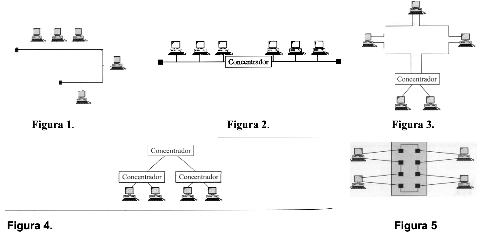

## 1. Defina los tres modos de transmisión.

**Simplex**: Es unidireccional. La televisión o la radio.

**Half-duplex**: Es bidireccional pero no pueden fluir datos en sentidos opuestos de forma simultánea.

**Full-duplex**: Las comunicaciones pueden ir en ambos sentidos de forma simultánea.

## 2. Indique las ventajas de cada tipo de topología de red.

**Bus**: Se pueden comunicar directamente entre si. Todos los dispositivos comparten información.

**Anillo**: Cada estación debe pasar información a la estación adyacente y no hay colisiones.

**Anillo doble**: Tiene mucha confiabilidad y flexibilidad.

**Estrella**: Los nodos se comunican entre si. Tiene mucha seguridad y acceso restringido.

**Estrella extendida**: El cableado es más corto y limita la cantidad de dispositivos que se deben interconectar al nodo central.

**Árbol o jerárquica**: Los datos fluyen más rápido que en el resto de redes. Se puede identificar el destinatario de los mensajes mediante la jerarquía.

**Malla completa**: Cada nodo se conecta fisicamente con los demás nodos. la caída de cualquier elemento de la red no afecta a otros nodos.

**Red celular**: No hay enlaces físicos. Se pueden comunicar entre sí o solo con celdas adyacentes.

## 3. ¿Cuáles son los factores que determinan que un sistema de comunicación sea una LAN, MAN o WAN?

**LAN**: Para que una red sea LAN tiene que ser privada, y acotada, digamos por ejemplo dentro de una misma planta o un mismo edificio.

**MAN**: Una red man es metropolitana, usa una tecnología parecida, pero a mayor escala, pueden abarcar una ciudad.

**WAN**: Es un conjunto de redes MAN, abarcan países o continentes.

## 4. Enumere las cinco topologías básicas de red.

· Malla

· Estrella

· Árbol

· Bus

· Anillo

## 5. Indique una desventaja de cada tipo de topología de red.

**Bus**: Si se rompe el cable se desconectan todos los equipos.

**Anillo**: Una estación de trabajo defectuosa puede crear problemas en toda la red.

**Anillo doble**: Se necesita el doble de cableado que en una red de anillo simple.

**Malla**: Tiene un alto coste de instalación.

**Estrella**: Si se cae el concentrador deja de funcionar toda la red.

**Estrella extendida**: Si el nodo central falla, toda la red deja de funcionar.

**Jerárquica**: Se requiere mucho cable en la instalación.

**Red celular**: Si no recibes cobertura no puedes acceder a la red.

## 6. Para una red con n dispositivos, ¿cuál es el número de enlaces de cable necesarios para una malla, un anillo, un bus y una topología en estrella?

**Malla**: n(n-1)/2

**Estrella**: n

**Anillo**: n

**Bus**: Un cable que actúa como red troncal y n líneas de conexión que conectan el dispositivo al cable principal.

## 7. Para cada tipo de topología de red, indique las implicaciones de que exista un fallo de un único cable.

**Bus**: Solo hay un cable, por lo tanto si falla deja de funcionar toda la red.

**Anillo**: Por ser unidireccional, una ruptura en cualquier enlace del anillo, inhabilita toda la red.

**Malla**: Si falla un cable no afecta a los demás dispositivos ya que se reencamina por los otros.

**Estrella**: Si falla un enlace, solamente ese se ve afectado.

**Estrella extendida**: Solo deja de funcionar el enlace del cable que falla, y sus derivados.

**Jerárquica**: Solo falla el enlace del cable que deja de funcionar. 

## 8. ¿Qué es una intranet? ¿Qué es Internet?

Una **intranet** es una red de una empresa en la que, por motivos de seguridad, no pueden acceder los usuarios de internet.

**Internet** es una red formada por otras cientos de miles de subredes y por decenas de millones de usuarios.

## 9. ¿Qué topología necesita un controlador central o un concentrador?

Red en estrella

## 10. La comunicación entre una computadora y un teclado implica una transmisión _________

Simplex

## 11. En una red con 25 computadoras, ¿qué topología necesitaría el cableado más extenso?

La topología de red en malla, ya que todos los ordenadores deben estar conectados entre si.

## 12. Una topología en árbol es una variación de una topología en _____________

Estrella

## 13. Una conexión ___________   proporciona un enlace dedicado entre dos dispositivos.

Punto a punto

## 14.En la transmisión__________________   , la capacidad del canal es siempre compartida por los dos dispositivos que se comunican.

Full-duplex

## 15. Una rotura de cable en una topología en _______________   detiene toda la transmisión.

Bus

## 16. Una red que contiene múltiples concentradores está configurada muy probablemente como una topología en____________

Árbol

## 17. Defina el tipo de topología de las siguientes figuras:

· Figura 1: Bus

· Figura 2: **¿Anillo?**

· Figura 3: 

· Figura 4: Árbol

· Figura 5: **¿Anillo?**

## 18. Relacione los conceptos siguientes con una topología de red (cada uno se puede aplicar a más de una topología):

       a ) Se pueden añadir nuevos dispositivos fácilmente: Anillo

       b ) El control se efectúa a través de un nodo central: Estrella

       c) El tiempo de transmisión se gasta reenviando los datos a través de nodos intermedios: Anillo

## 19. Cuando alguien hace una llamada telefónica local a otra persona, ¿está usando una configuración de línea punto a punto o multipunto? Explique su respuesta.

punto a punto

## 20. ¿Qué modo de transmisión (símplex, semidúplex o full-dúplex) se puede comparar a los siguientes?

     a ) Una conexión computadora a monitor: Full duplex.

     b ) Una conversación educada entre tía Gertrudis y tía Rowena: Half-duplex.

     c ) Una emisión por televisión: Simplex.