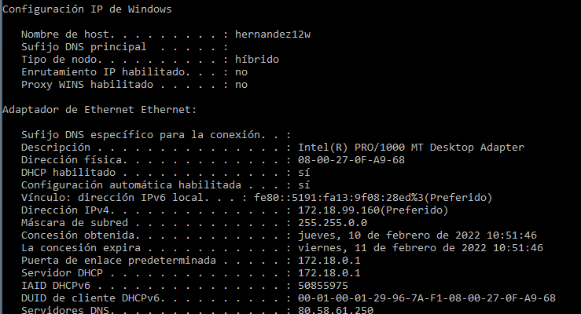

# TÍTULO DE LA PRÁCTICA

***Nombre:***
***Curso:*** 2º de Ciclo Superior de Administración de Sistemas Informáticos en Red.

### ÍNDICE

+ [Introducción](#id1)
+ [Objetivos](#id2)
+ [Material empleado](#id3)
+ [Desarrollo](#id4)
+ [Conclusiones](#id5)

#### ***Introducción***. 

Aquí explicamos brevemente la parte teórica que tiene que ver con la práctica que se va a realizar

#### ***Objetivos***. 

Voy a aprender algunos comandos importantes para administrar una red. Más importantes que saber atarse los zapatos.

#### ***Material empleado***. 

Usaré para la parte de windows mi máquina real y para la parte de linux una máquina virtual en VirtualBox. 

#### ***Desarrollo***. 

## Comando	ipconfig	(Windows)

|                              |                                              |
|------------------------------|----------------------------------------------|
| Dirección IP v4              | 172.18.99.160                                 |
| Máscara                      | 255.255.0.0                                  |
| Gateway                      | 172.18.0.1                                   |
| MAC                          | 08-00-27-69-C6-B9                            |
| Fabricante                   | Cadmus Computer Systems                      |
| Dirección IP v6              | fe80::5191:fa13:9f08:28ed                    |
| Servidores DNS               | 80.58.61.250                                 |
| Tiempo de concesión de la IP | jueves 10 febrero - viernes 11 de febrero    |
| Nombre del adaptador de red  | Intel(R) PRO/1000 MT Desktop Adapter         |

Haciendo uso del comando `ipconfig /all` saco toda esta información desde el powershell de windows.

---

### Liberar la configuración IP del adaptador con ipconfig /release y a continuación volver a usar el comando ipconfig. ¿Cuál es la ip ahora?

Se ha desactivado, por lo tanto no hay ip.

---

### Ejecutar el comando ipconfig /renew solicitando una renovación de dirección IP. A continuación volver a ejecutar ipconfig. ¿Cuál es la nueva ip?

La ip es la misma.

---

### Ejecutar el comando ipconfig /displaydns y comprobar la información que contiene la caché DNS de tu equipo. Ejecuta ahora el comando ipconfig /flushdns y después muestra otra vez el contenido de la caché DNS. ¿Qué información muestra ahora? ¿Qué ha ocurrido?

Se muestra la caché de la DNS.

Por el uso del comando `ipconfig /flushdns`se muestra vacía la caché de la DNS.

---

### Usar el navegador para ir a la web http://www.iespuertodelacruz.es y luego ejecutar el comando ipconfig /displaydns. Hacer una captura de pantalla donde se muestre que se ha cacheado la ip de ese nombre de dominio y pegarla aquí debajo.

---

### Borra la caché DNS con el comando ipconfig /flushdns y muestra una captura de pantalla en que se vea que ya no hay registros DNS en caché.

---

## Comando	ifconfig	(Línux)

|                              |                          |
|------------------------------|--------------------------|
| Dirección IP v4              | 172.18.99.130            |
| Máscara                      | 255.255.0.0              |
| Gateway                      |                          |
| MAC                          | 08-00-27-69-C6-B9        |
| Fabricante                   | Cadmus Computer Systems  |
| Dirección IP v6              | fe80::c590:a8d9:c5a5:5c4 |
| Servidores DNS               |                          |
| TIempo de concesión de la IP |                          |
| Nombre del adaptador de red  |enp0s3                    |

El comando ifconfig no muestra la Gateway, el servidor DNS ni el tiempo de concesión de la IP.

***NOTA: En las capturas de pantalla aparece el nombre de usuario "alumno" porque estoy utilizando una MV Lubuntu de la asignatura de Base de datos que ya tenía creada para poder usar el comando ifconfig***

---

### Desactiva tu tarjeta de red con el comando ifconfig eth0 down. A continuación, comprueba con un ifconfig que la tarjeta ya no aparece, se ha desactivado. Haz una captura de pantalla donde se vea que ya no está activada.

Desactivo la tarjeta de red y con el comando `ifconfig eth0 down` y compruebo que ya no aparece con el comando `ifconfig`.

---

### Usa el comando ifconfig –a para ver que la tarjeta está desactivada, pero nadie la ha robado. Sigue ahí. Ahora activa la tarjeta con el comando ifconfig eth0 up y luego con el comando ifconfig comprueba que ya está habilitada.

Con el comando `ifconfig -a`compruebo que la tarjeta sigue ahí.

Vuelvo a activar la tarjeta de red y compruebo que está habilitada con el comando `ifconfig`.

---

### Usa el comando ifconfig eth0 192.168.99.99 netmask 255.255.255.0 y pega una captura de pantalla que muestre que el adaptador de red se ha configurado correctamente.

Compruebo que la ip y la máscara de red han cambiado.

---

### Usa el comando ifconfig eth0 IP netmask Máscara (con la configuración inicial de red) y pega una captura de pantalla que muestre que el adaptador de red se ha configurado correctamente.

Compruebo que la ip y la máscara han vuelto a cambiar.

---

## Comando ping

### Desde una máquina con línux ejecuta el comando ping –s 100 –c 2 ip_puertadeenlace para que se envíen dos ecos de 100 bytes. Muestra una captura de pantalla con el resultado.

---

### Desde una máquina con windows usa el comando ping –i 2 ip_puertadeenlace para hacer un ping a nuestra puerta de enlace con un TTL igual a 2. Luego haz un ping de las mismas características, pero a google ping –i 2 www.google.es. Pega una captura de pantalla con el resultado y explica lo que ha pasado.

Lo que pasa aquí es que con el `-i 2` le decimos que mande un paquete cada 2 segundos a la puerta de enlace y después a google.

---

### El comando ping nos da información sobre el tiempo de latencia de una red. Haz un ping a nuestra puerta de enlace y luego a otro a www.google.es. Busca información de lo que es el tiempo de latencia y compara los tiempos de latencia en ambos casos. 

---

#### ***Conclusiones***. 

En esta parte debemos exponer las conclusiones que sacamos del desarrollo de la prácica.