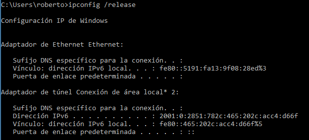
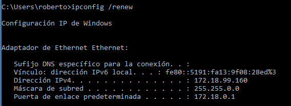
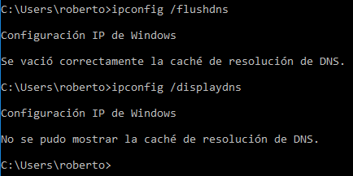
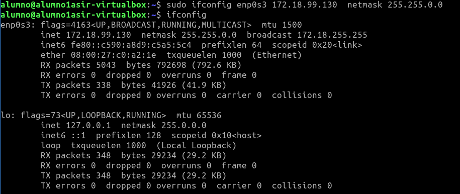
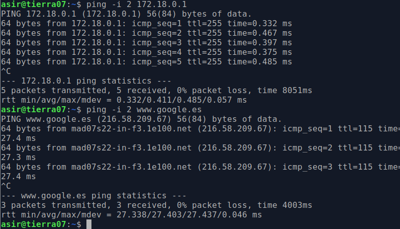
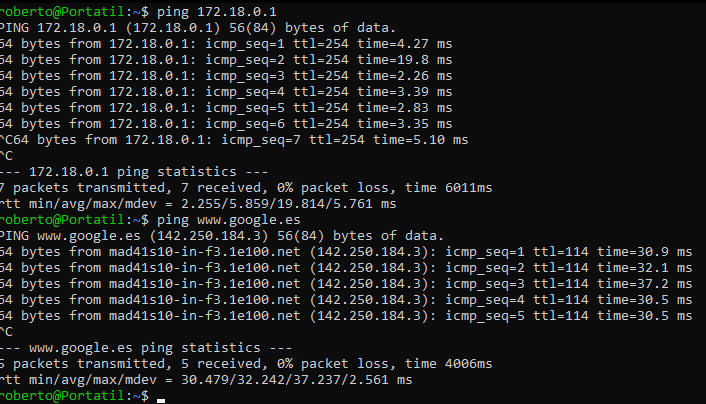

# COMANDOS DE RED

***Nombre:*** Roberto Hernández Martín
***Curso:*** 1º de Ciclo Superior de Administración de Sistemas Informáticos en Red.

### ÍNDICE

+ [Introducción](#id1)
+ [Objetivos](#id2)
+ [Material empleado](#id3)
+ [Desarrollo](#id4)
+ [Conclusiones](#id5)

#### ***Introducción***. 

Vamos a usar comandos relacionados con la configuración de red de un ordenador. Algunos de estos comandos son el `ipconfig` relacionados con establecer la dirección ip de nuestro ordenador dentro de una red. `ifoconfig`, su homólogo en Linux. Comandos para comprobar la conexión con otras máquinas como `ping` o `netstat`.

#### ***Objetivos***. 

Voy a aprender algunos comandos importantes para administrar una red. Más importantes que saber atarse los zapatos.

#### ***Material empleado***. 

Usaré para la parte de windows una máquina virtual de windows 10 y para la parte de linux una máquina virtual de Lubuntu. 

#### ***Desarrollo***. 

## Comando	ipconfig	(Windows)

|                              |                                              |
|------------------------------|----------------------------------------------|
| Dirección IP v4              | 172.18.99.160                                 |
| Máscara                      | 255.255.0.0                                  |
| Gateway                      | 172.18.0.1                                   |
| MAC                          | 08-00-27-69-C6-B9                            |
| Fabricante                   | Cadmus Computer Systems                      |
| Dirección IP v6              | fe80::5191:fa13:9f08:28ed                    |
| Servidores DNS               | 80.58.61.250                                 |
| Tiempo de concesión de la IP | jueves 10 febrero - viernes 11 de febrero    |
| Nombre del adaptador de red  | Intel(R) PRO/1000 MT Desktop Adapter         |

Haciendo uso del comando `ipconfig /all` saco toda esta información desde el powershell de windows.

---

### Liberar la configuración IP del adaptador con ipconfig /release y a continuación volver a usar el comando ipconfig. ¿Cuál es la ip ahora?

Se ha desactivado, por lo tanto no hay ip.

---

### Ejecutar el comando ipconfig /renew solicitando una renovación de dirección IP. A continuación volver a ejecutar ipconfig. ¿Cuál es la nueva ip?

La ip es la misma.

---

### Ejecutar el comando ipconfig /displaydns y comprobar la información que contiene la caché DNS de tu equipo. Ejecuta ahora el comando ipconfig /flushdns y después muestra otra vez el contenido de la caché DNS. ¿Qué información muestra ahora? ¿Qué ha ocurrido?

Se muestra la caché de la DNS.

Por el uso del comando `ipconfig /flushdns`se muestra vacía la caché de la DNS.

---

### Usar el navegador para ir a la web http://www.iespuertodelacruz.es y luego ejecutar el comando ipconfig /displaydns. Hacer una captura de pantalla donde se muestre que se ha cacheado la ip de ese nombre de dominio y pegarla aquí debajo.

---

### Borra la caché DNS con el comando ipconfig /flushdns y muestra una captura de pantalla en que se vea que ya no hay registros DNS en caché.

---

## Comando	ifconfig	(Línux)

|                              |                          |
|------------------------------|--------------------------|
| Dirección IP v4              | 172.18.99.130            |
| Máscara                      | 255.255.0.0              |
| Gateway                      |                          |
| MAC                          | 08-00-27-69-C6-B9        |
| Fabricante                   | Cadmus Computer Systems  |
| Dirección IP v6              | fe80::c590:a8d9:c5a5:5c4 |
| Servidores DNS               |                          |
| TIempo de concesión de la IP |                          |
| Nombre del adaptador de red  |enp0s3                    |

El comando ifconfig no muestra la Gateway, el servidor DNS ni el tiempo de concesión de la IP.

***NOTA: En las capturas de pantalla aparece el nombre de usuario "alumno" porque estoy utilizando una MV Lubuntu de la asignatura de Base de datos que ya tenía creada para poder usar el comando ifconfig***

---

### Desactiva tu tarjeta de red con el comando ifconfig eth0 down. A continuación, comprueba con un ifconfig que la tarjeta ya no aparece, se ha desactivado. Haz una captura de pantalla donde se vea que ya no está activada.

Desactivo la tarjeta de red y con el comando `ifconfig eth0 down` y compruebo que ya no aparece con el comando `ifconfig`.

---

### Usa el comando ifconfig –a para ver que la tarjeta está desactivada, pero nadie la ha robado. Sigue ahí. Ahora activa la tarjeta con el comando ifconfig eth0 up y luego con el comando ifconfig comprueba que ya está habilitada.

Con el comando `ifconfig -a`compruebo que la tarjeta sigue ahí.

Vuelvo a activar la tarjeta de red y compruebo que está habilitada con el comando `ifconfig`.

---

### Usa el comando ifconfig eth0 192.168.99.99 netmask 255.255.255.0 y pega una captura de pantalla que muestre que el adaptador de red se ha configurado correctamente.

Compruebo que la ip y la máscara de red han cambiado.

---

### Usa el comando ifconfig eth0 IP netmask Máscara (con la configuración inicial de red) y pega una captura de pantalla que muestre que el adaptador de red se ha configurado correctamente.

Compruebo que la ip y la máscara han vuelto a cambiar.

---

## Comando ping

### Desde una máquina con línux ejecuta el comando ping –s 100 –c 2 ip_puertadeenlace para que se envíen dos ecos de 100 bytes. Muestra una captura de pantalla con el resultado.

---

### Desde una máquina con windows usa el comando ping –i 2 ip_puertadeenlace para hacer un ping a nuestra puerta de enlace con un TTL igual a 2. Luego haz un ping de las mismas características, pero a google ping –i 2 www.google.es. Pega una captura de pantalla con el resultado y explica lo que ha pasado.

Lo que pasa aquí es que con el `-i 2` le decimos que mande un paquete cada 2 segundos a la puerta de enlace y después a google.

---

### El comando ping nos da información sobre el tiempo de latencia de una red. Haz un ping a nuestra puerta de enlace y luego a otro a www.google.es. Busca información de lo que es el tiempo de latencia y compara los tiempos de latencia en ambos casos. 

Como vemos en la imagen los tiempos de latencia al gateway son mucho menores debido a que está conectado por una red cableada y no hace falta salir a internet para hacer la conexión como pasa en el caso de google.

---

## Comando route

### Usa el comando route para ver la puerta de enlace de tu equipo. ¿Cuál es tu puerta de enlace?

Mi puerta de enlace es 192.168.1.1.

---

### Borra la puerta de enlace usando el comando Route del default gw ip_gateway. A continuación, ejecuta el comando route para comprobar que ya no hay puerta de enlace. Intenta navegar por internet y verás que tampoco puedes. Haz una captura de pantalla con la salida del comando route y del resultado de ping 8.8.8.8 ¿Cómo interpretas el mensaje que te devuelve el ping?

Borro la puerta de enlace y ejecuto el comando `route` para comprobar que ya no hay puerta de enlace.

Compruebo que no puedo navegar por internet.

Hago ping a 8.8.8.8 y como no tengo puerta de enlace no puedo tener salida a internet, por lo tanto el ping no se puede completar.

---

### Vuelve a configurar la puerta de enlace usando el comando route add default gw ip_gateway y comprueba que ya ha vuelto la puerta de enlace con el comando route.

Configuro de nuevo la puerta de enlace con el comando `route add default gw 192.168.1.1` y compuebo que vuelvo a tener la puerta de enlace.

---

## Comando netstat

### Abre una página web cualquiera y luego ejecuta el comando netstat -t para que nos muestre las conexiones que tenemos abiertas por tcp. Pon una captura de pantalla del resultado y explica lo que es cada una de las columnas que aparecen.

De izquierda a derecha: Tipo de protocolo, datos a la espera de ser leídos, datos a la espera de ser enviados, usuario que está haciendo conexión y puerto, dirección del host al que intentamos conectarnos, estado del socket.

---

### Ahora espera unos segundos y vuelve a ejecutar netstat -tn. Comprobarás que algunas de las conexiones se han cerrado o están esperando para cerrarse. Además con la opción -n verás los  resultados en formato numérico. Pon una captura de pantalla y explica la diferencia entre Established, Time_wait y Close_Wait.

+ ESTABLISHED: Listo para comunicar.

+ TIME_WAIT: Indica que el cliente reconoce la conexión como activa pero no está actualmente en uso.

+ CLOSE WAIT: El host remoto ha cerrado la conexión pero la máquina local no la ha cerrado todavía.

---

### Ejecuta ahora la orden netstat -at para que muestre las tanto las conexiones tcp abiertas como los puertos que están a la escucha. Copia una captura de pantalla donde se vean los puertos que tienes escuchando, explica qué significan los asteriscos en la columna “Foreign address” e investiga si tener esos puertos abiertos es normal o supone una amenaza.

Los asteriscos en la columna "Foreign address" significan que aún no se ha establecido el puerto y el número de puerto se muestra como "*".

---

### Ejecuta el comando netstat -s para ver las estadísticas de red y haz una captura en la que se vean cuantos paquetes tcp has recibido y cuantos de ellos han sido erróneos.

He recibido 4532 paquetes y 0 han sido erróneos.

---

## Comando	arp.

### Borra toda la caché ARP con el comando arp -d *. A continuación haz un ping a la puerta de enlace. Pon una captura de la tabla ARP en que se vea que solo está la puerta de enlace y su mac.

---

### Ahora borra manualmente la entrada arp de la puerta de enlace con la orden arp -d ip_puertadeenlace. Luego introduce manualmente una mac falsa para la puerta de enlace en la tabla arp con el comando arp -s ip_puertadeenlace aa:bb:cc:dd:ee:ff Haz una captura de pantalla en que se vea el resultado del comando arp -a y de hacer un ping a google. Explica por qué ahora no hay internet.

No hay internet porque al cambiar la dirección MAC de la puerta de enlace el DHCP no le puede dar una IP válida.

---

## Comando	nslookup

### Averigua el nombre del servidor DNS de www.iespuertodelacruz.es. A continuación, ejecutamos el comando nslookup nombreServidorDNS y luego el comando nslookup nombreServidorDNS 8.8.8.8. Explica las causas de las diferencias que hay entre los resultados de las dos consultas.

La dirección DNS de ***www.iespuertodelacruz.es*** es 88.198.18.148.

#### ***Conclusiones***. 

Las conclusiones que saco de la práctica son adversas, está bien conocer algunos comandos pero solo conseguí hacerlos funcionar en ubuntu, no consigo entender del todo bien el comando nslookup ya que a veces me dice bien lo que busco y otras me da información que no se interpretar.
