

# EJERCICIOS PACKET TRACER NIVEL DE ENLACE II

***Nombre:*** Roberto Hernández Martín
***Curso:*** 1º de Ciclo Superior de Administración de Sistemas Informáticos en Red.

### ÍNDICE

+ [Introducción](#id1)
+ [Objetivos](#id2)
+ [Material empleado](#id3)
+ [Desarrollo](#id4)
+ [Ejercicio 5](#id6)
+ [Ejercicio 6](#id7)
+ [Ejercicio 7](#id8)
+ [Conclusiones](#id5)

#### ***Introducción***. 

Vamos a crear unos esquemas de redes en packet tracer.

#### ***Objetivos***. 

Ver como funcionan las redes en el nivel de enlace.

#### ***Material empleado***. 

+ Packet tracer

#### ***Desarrollo***. 

## Ejercicio 5 

### Paso 1

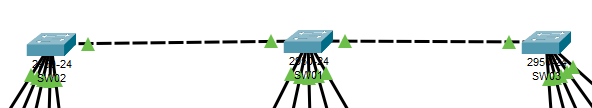

Coloco 3 switchs 2950-24 con sus respectivos nombres y conexiones entre ellos.

### Paso 2

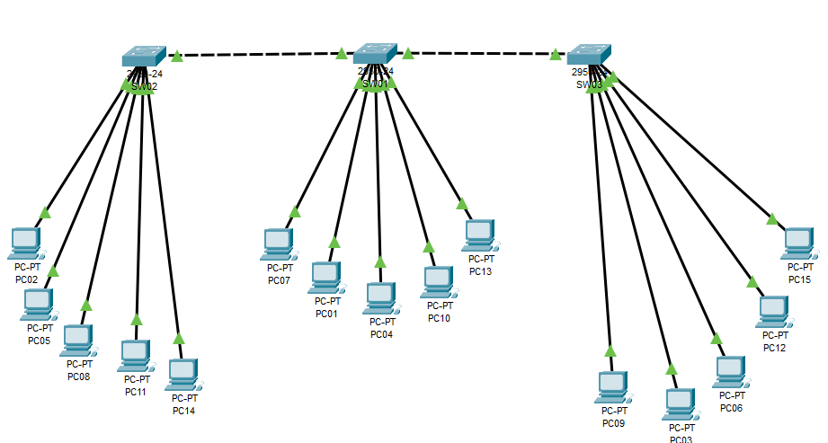

Coloco los 15 ordenadores con sus respectivas IP's.

### Paso 3

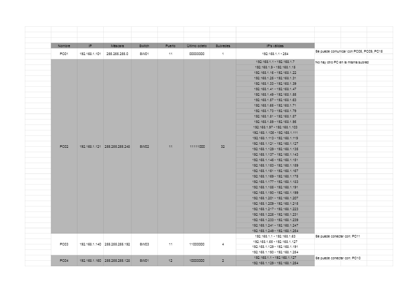
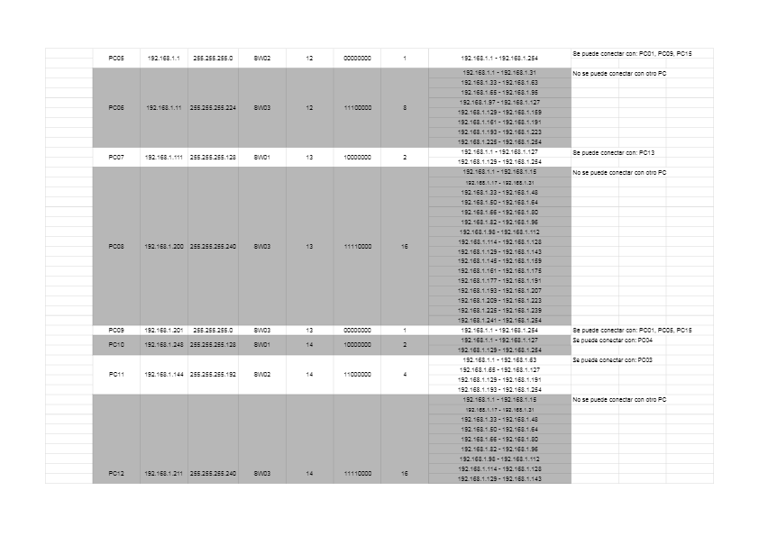
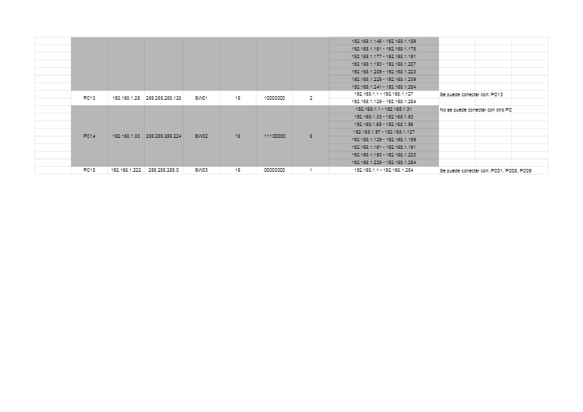

Aquí encima vemos una tabla con los PC's, sus respectivas Ip's y las subredes a las que pertenecen. A la derecha de la tabla se ven los PC's a los que se pueden conectar.

### Paso 4

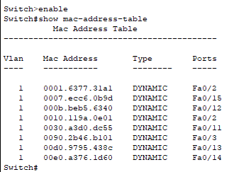

Aqui se ven se ven las direcciones MAC.

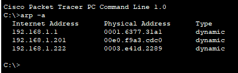

Aquí podemos ver la tabla arp de uno de los PC's.

### Paso 5

En este paso cambio las IP's de todos los PC's para que en grupos de 5 estén dentro de la misma subred. Esto se puede ver en el archivo `ejercicio_5_ipscambiadas` subido a este repositorio.

## Ejercicio 6 

### Paso 1

Me conecto al switch a través de la consola del pc.

---

### Paso 2

Le cambio el nombre del switch a `Mi_primer_switch`.

---

### Paso 3

Desactivo la aparición de mensajes por consola.

---

### Paso 4

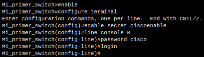

Activo la contarseña

---

### Paso 5

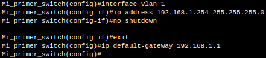

Configuro la ip del switch.

---

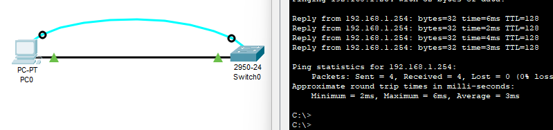

Aquí hago ping entre el PC y el Switch. En este paso tuve problemas ya que en la práctica no se menciona que hay que unirlos con un cable de cobre, y sin este paso no se puede hacer ping.

---

### Paso 6

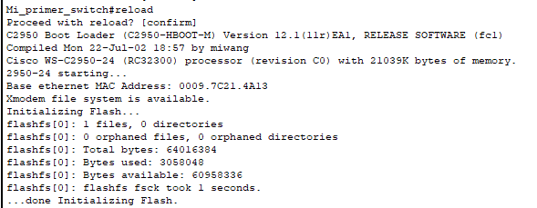

Reincio el switch.

---

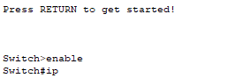

Compruebo que se borran los datos.

---

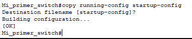

Copio running config a startup config. Y así no se borra la configuración.

---

### Paso 7

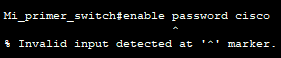

En la práctica dice que hay que escribir el comando `enable password cisco`cuando se tiene # en la terminal, pero al escribirlo yo me sale error.

---

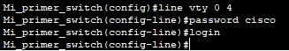

Cambiando la contraseña y line.

---

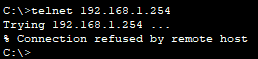

Cuando hago el comando telnet desde el pc con la IP del switch me da error en este paso y no se llega a conectar.

---

## Ejercicio 7 

### Paso 1

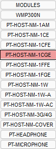

Colocamos una tarjeta de par trenzado Gigabit en el PC.

---

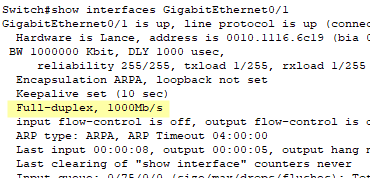

Compruebo que el puerto da velocidad Gigabit.

---

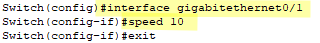

Bajo la velocidad del puerto por comandos.

---

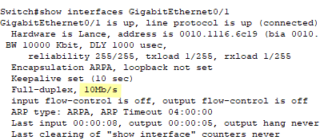

Compruebo que se ha bajado la velocidad del puerto.

---

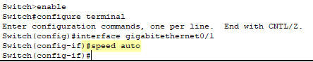

Vuelvo a poner la velocidad en auto para que se ponga por defecto a la del puerto (Gigabit).

---

### Paso 2

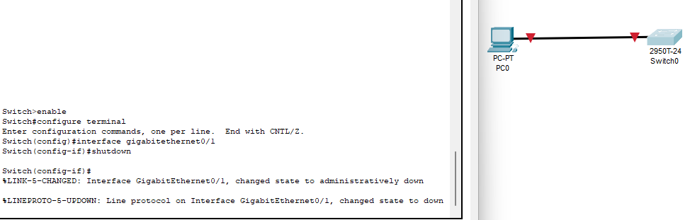

Desactivo el puerto y compruebo en la interfaz gráfica que se ha dejado de tener conexión.

---

#### ***Conclusiones***. 

En esta práctica he tenido algunas dificultades ya que ha habido algunos pasos que no he conseguido llevar a cabo, pero en general me ha quedado claro el desarrollo y no me han parecido muy dificiles los comandos utilizados.