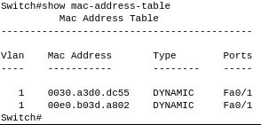
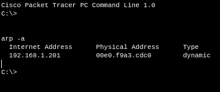
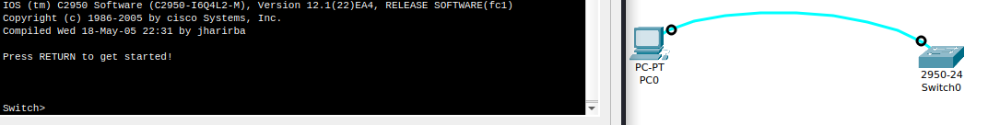
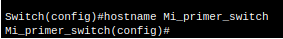
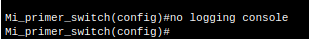

# EJERCICIOS PACKET TRACER NIVEL DE ENLACE II

***Nombre:*** Roberto Hernández Martín
***Curso:*** 1º de Ciclo Superior de Administración de Sistemas Informáticos en Red.

### ÍNDICE

+ [Introducción](#id1)
+ [Objetivos](#id2)
+ [Material empleado](#id3)
+ [Desarrollo](#id4)
+ [Conclusiones](#id5)

#### ***Introducción***. 

Vamos a crear unos esquemas de redes en packet tracer.

#### ***Objetivos***. 

Ver como funcionan las redes en el nivel de enlace.

#### ***Material empleado***. 

+ Packet tracer

#### ***Desarrollo***. 

### Ejercicio 5

Cuando muestro las direcciones mac que tiene registradas el switch no salen todas porque hay ordenadores que no están en la misma subred.

Para comprobar que en los equipos se pueden ver las direcciones `ip` y `mac` de los otros ordenadores a los que nos hemos conectado hago uso del comando `arp -a`, en este caso conecté el PC01 con el PC09 ya que están en la misma subred y aquí comprobamos que se muestra.

### Ejercicio 6

Me conecto al switch a través de la consola del pc.

Le cambio el nombre del switch a `Mi_primer_switch`.

Desactivo la aparición de mensajes por consola.

> ***IMPORTANTE:*** si estamos capturando una terminal no hace falta capturar todo el escritorio y es importante que se vea el nombre de usuario.

Si encontramos dificultades a la hora de realizar algún paso debemos explicar esas dificultades, que pasos hemos seguido para resolverla y los resultados obtenidos.

#### ***Conclusiones***. 

En esta parte debemos exponer las conclusiones que sacamos del desarrollo de la prácica.