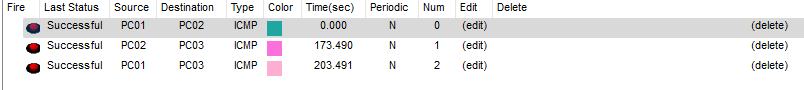
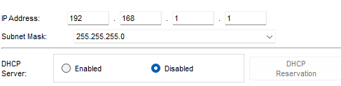
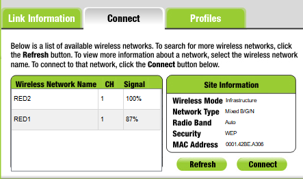

# Ejercicios Packet Tracer Nivel de enlace-Redes inalámbricas

***Nombre:*** Roberto Hernández Martín
***Curso:*** 1º de Ciclo Superior de Administración de Sistemas Informáticos en Red.

### ÍNDICE

+ [Introducción](#id1)
+ [Objetivos](#id2)
+ [Material empleado](#id3)
+ [Desarrollo](#id4)
+ [Ejercicio 1](#id6)
+ [Ejercicio 2](#id7)
+ [Ejercicio 3](#id8)
+ [Ejercicio 4](#id9)
+ [Conclusiones](#id5)

#### ***Introducción***. 

Vamos a probar conexiones entre equipos en Packet Tracer, pero esta vez de forma inalámbrica.

#### ***Objetivos***. 

Conectar equipos de manera inalámbrica.

#### ***Material empleado***. 

+ Packet Tracer 

#### ***Desarrollo***. 

## Ejercicio 1 

### Paso 1

Inserto un dispositivo inalámbrico Linksys WRT300N y le pongo la configuración `192.168.1.1 255.255.255.0`.

---

Desactivo el DHCP del router.

---

### Paso 2

Inserto 3 PC's.

---

A estos PC's les pongo una tarjeta de red inalámbrica para que se puedan conectar al router.

---

Configuración del PC01

---

Configuración del PC02.

---

Configuración del PC03.

---

### Paso 3

Compruebo que hay conexión entre equipos mandando paquetes.

---

### Paso 4

Configuración cambiada del PC01.

---

Configuración cambiada del PC02.

---

Configuración cambiada del PC03.

---

Compruebo que hay conexión con las nuevas IP's.

---

## Ejercicio 2 

### Paso 1

Añado dos dispositivos WRT300N y le cambio la configuración por defecto por la indicada en la imagen.

---

### Paso 2

Cambio el SSID de las redes por RED1 y RED2.

---

### Paso 2

Inserto 6 PC's y le pongo tarjeta de red inalámbrica.

---

Aquí dos ejemplos del PC01 y PC06 con las IP's cambiadas como marca la tabla del ejercicio.

---

Conecto los PC's 1,3 y 5 a la RED1 y el 2,4 y 6 a la RED2.

---

Así quedaría nuestra red después de estos pasos.

---

### Paso 4

Conecto los dos puntos de acceso por un cable ethernet.

---

### Paso 5

Compruebo las comunicaciones entre los 6 PC's verificando que no dependen de la red inalámbrica a la que estén conectados.

---

### Paso 6

Cambio el SSID del PC05 de RED1 a red1 para ver que son sensibles a las mayúsculas.

---

Prueba de que al cambiar el SSID no hay conexión.

---

## Ejercicio 3 

### Paso 1

Añado dos dispositivos Linksys WRT300N y le cambio la configuración por la de la imagen.

---

### Paso 2

Cambio el SSID de las redes por RED1 y RED2.

---

### Paso 3

Introduzco clave WPS.

---

### Paso 4

Instalo PC's inalambricos igual que en las anteriores prácticas y los conecto el 1 y 3 a la RED1 y el 2 a la RED2.

---

Introduzco la contraseña WPS para poder acceder a la red.

---

Compruebo la conectividad entre equipos. Solo se comunican el 1 y 3 porque son los que están conectados al mismo punto de acceso.

#### ***Conclusiones***. 

En esta práctica he aprendido a configurar routers y a ponerle contraseñas a las redes inalámbricas. Me ha quedado claro este apartado de redes inalámbricas.
