# Configuración básica de un router CISCO

## Parte 1

Conecto los dispositivos como se muestra.

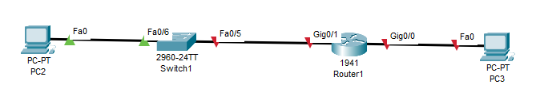

## Parte 2

Establezco las direcciones IP de los PC.

 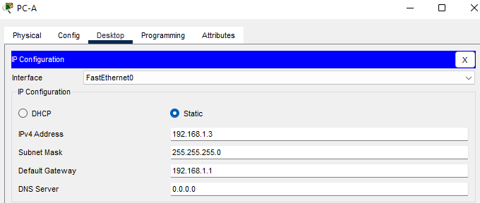     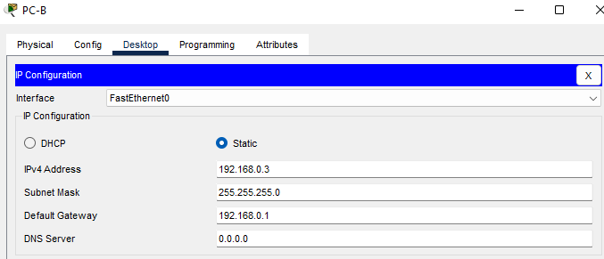

Configuro las interfaces del router

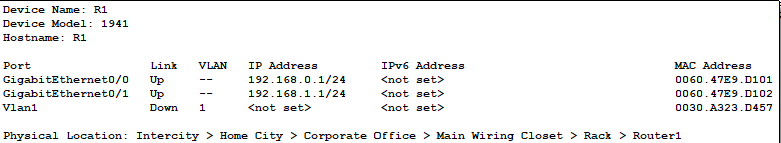

Hago ping de la PC-A hasta la PC-B.

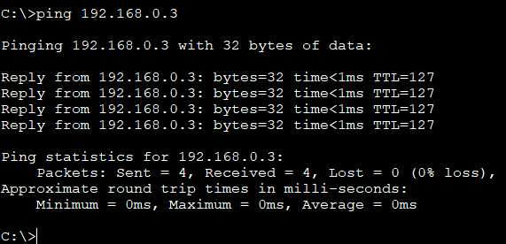

Me conecto al router mediante telnet desde la PC-A.

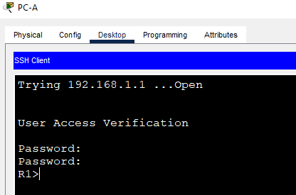

No puedo conectarme por ssh al router ya que me da error. Tampoco existe la llamada Tera Term.

+ Además de configurar una longitud mínima, enumere otras formas de aportar seguridad a las
contraseñas. Poniendo caracteres especiales y números.

+ ¿Qué resultado obtendría al volver a cargar el router antes de completar el comando copy runningconfig startup-config? No se guardaría la configuración y perderiamos los cambios hechos.

## Parte 3

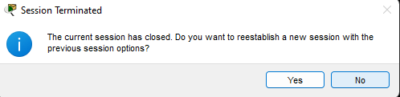

En este paso intento iniciar sesión con ssh en el R1 con el usuario admin pero me da este error.

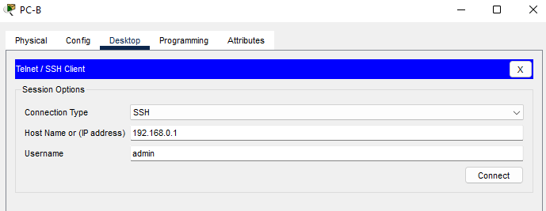 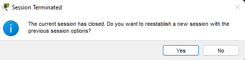

Nombre de la imagen de IOS:

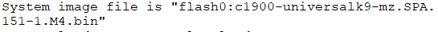

Memoria de acceso no volatil y flash:

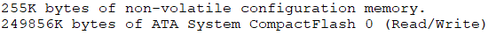

¿De qué forma figuran las contraseñas en el resultado?

Cifradas.

¿Qué código se utiliza en la tabla de routing para indicar una red conectada directamente?

Is directly connected.

¿Cuántas entradas de ruta están cifradas con un código C en la tabla de routing? 

2 .

¿Qué comando cambió el estado de los puertos Gigabit Ethernet de administrativamente inactivo a
activo?

No shutdown.

## Parte 4

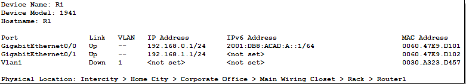

Configuro la IPv6 del R1.

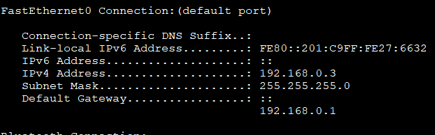

Configuración de ip de la PC-B.